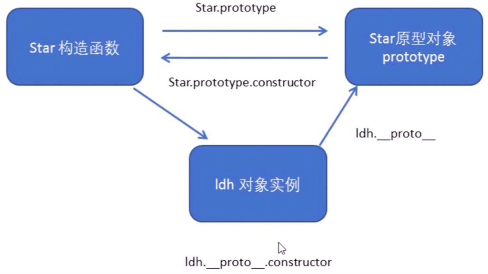
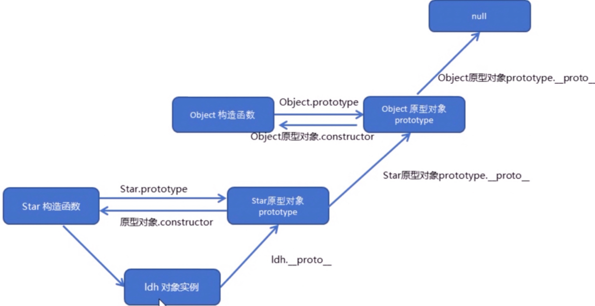

# 1⃣️ js基础语法


# 一.基础概念

## 1.编程语言

### (1)编程

- 编程

  ​	—— 让计算机为解决某个问题而使用某种程序设计语言编写程序代码，并最终得到结果的过程。

- 计算机程序

  ​    —— 计算机（任何能够执行代码的设备）所执行的一系列的**指令集合**，通过计算机语言向计算机发出指令

### (2)计算机语言

​			—— 人与计算机之间通讯的语言

- 机器语言
  - 0 1 组成的二进制数（**计算机语言的基础**）
- **汇编语言 【编程语言】**
  - 直接对硬件操作，指令采用英文缩写标识符，易于识记
- **高级语言 【编程语言】**
  - 包括了很多编程语言

### (3)翻译器

**高级语言**所编制的程序不能直接被计算机识别，**必须经过转换才能执行**

将源代码转**换为计算机能够识别的机器语言**  =>  **二进制化**

### (4)编程语言、标记语言 的区别

- 编程语言

  —— **有很强的逻辑和行为能力**。有很多if else、for、while等具有逻辑和行为能力的指令，是**主动**的。

- 标记语言

  —— 不用向计算机发出指令，常用语格式化和链接。用来被读取的，是**被动**的。

## 2.计算机基础

### (1)计算机组成

- 硬件
  - 输入设备
  - 输出设备
  - CPU     
  - 硬盘
  - 内存
- 软件
  - 系统软件
  - 应用软件

### (2)数据存储

​		—— 所有数据、程序都是以二进制数据的形式存放在硬盘中

- 数据存储单位
  - **位（bit）**：1bit可以保存一个0或1 【最小存储单位】
  - **字节（Byte）**：1B = 8b
  - **千字节（KB）**：1KB = 1024B
  - **兆字节（MB）**：1MB = 1024KB
  - **吉字节（GB）**：1GB = 1024MB
  - **太字节（TB）**：1TB = 1024GB

### (3)程序运行

- 打开某个程序时，先从**硬盘**中把程序的代码加载到**内存**中
- **CPU**执行内存中的代码

## 3.JavaScript基本概念

​		—— 运行在客户端的**脚本语言**（读一行翻译一行）

​	[脚本语言不需要编译，运行过程中由**js引擎（解释器）**逐行解释并执行]

- 实现**业务逻辑**和**页面控制**

- **js的组成**
  - ECMAScript
    - 规定JS的编程语法、基础核心知识，是所有浏览器厂商共同遵守的一套JS语法工业标准
  - DOM —— **文档**对象模型
    - 处理可扩展标记语言的**标准编程接口**
    - 通过DOM提供的接口，可以**对页面的各种元素进行操作**（大小、位置等）
  - BOM —— **浏览器**对象模型
    - 提供独立于内容的、可以与浏览器窗口进行互动的对象结构
    - 通过BOM可以**操作浏览器窗口**（弹出框、控制浏览器跳转、获取分辨率等）


# 二、变量

​		—— 用于存放数据的容器。通过变量名获取数据、修改数据

​	 【程序在内容中申请的一块用来存放数据的空间】

```text
▪︎ 变量 —— let
▪︎ 常量 —— const
	▫︎ 把一个值永久地赋给一个名字
	▫︎ 声明时必须赋初始值
	▫︎ 常量的值不能改变
```

## 1.变量的使用

- 声明变量
- 赋值
- 变量的初始化【**声明一个变量并赋值**】

## 2.变量的语法扩展

- 更新变量
  - 变量被重新赋值，以最后一次赋的值为准

- 同时声明多个变量

  ```js
  let age = 10, name = "ljy", sex = "2";
  ```

- 声明变量的特殊情况

  ```text
  let age; console.log(age);     只声明，不赋值             undefined
  console.log(age);              不声明，不赋值 直接使用      报错
  age = 10; console.log(age);    不声明，只赋值              10
  ```

## 3.变量的命名规范

- 由字母、数字、下划线、美元符号组成
- **严格区分大小写**
- 不能以数字开头
- 不能是关键字、保留字
- 变量名要有意义
- 遵守<u>驼峰命名法</u>


## 🌰 var与let的区别

```text
① 函数作用域 
		—— var声明的变量不具备块级作用域
	▪︎ 作用域仅限于包含函数的函数体
	▪︎ 若在函数体外部，则会声明全局变量 —— 即全局对象的属性，全局对象可以通过globalThis引用
	【let和const声明的全局变量和常量不是全局对象的属性】

② 重复声明 
		—— var多次声明同名变量是合法的

③ 作用域提升 
		—— var声明变量时，该声明会提升的函数顶部，但初始化不会，因此在初始化之前，变量的值可能是undefined
```


## 🌰 交换两个变量值

```js
var temp;
var apple1 = "青苹果";
var apple2 = "红苹果";
temp = apple1;
apple1 = apple2;
apple2 = temp;

//ES6解构赋值
[apple2,apple2] = [apple1,apple2]
```


# 三、数据类型

JS是一种 **弱类型** ｜ **动态语言**

​		—— 不需要提前声明变量的类型，程序运行过程中类型会自动确定

## 1.数据类型的分类

- 简单数据类型（Number|String|Boolean|Undefined|Null）
- 复杂数据类型（Object）

### (1)简单数据类型（基本数据类型）

—— 存储变量时存储的是**值**

```text
Number           数字型（包含整型和浮点型）       0
Boolean          布尔值                      false
String           字符串型                      ""
Undefined       【没有属性与方法】            undefined
Null            【没有属性与方法】               null
Symbol           符号【ES6新增】
```

#### ① 数字型Number

- 数值范围
  - 最大值 `Number.MAX_VALUE`
  - 最小值 `Number.MIN_VALUE`

- 三个特殊值
  - Infinity 无穷大
  - -Infinity 无穷小
  - NaN 非数值

- isNaN() —— 判断一个变量是否为非数字的类型

- 计算

  ```text
  - Math.pow(a,b)  	a的b次方
  - 取整
    - Math.round()
    - Math.ceil()
    - Math.floor()
  - Math.abs()            绝对值
  - Math.random()         随机数
  - Math.sqrt()           平方根
  ```

#### ② 字符串型String

- 字符串转义符

  ```text
  \n        换行符
  \\        斜杠\
  \'        单引号'
  \"        双引号"
  \t        tab 缩进
  \b        空格
  ```

- 相关API

  ```text
  - s.substring(1,4)		     //获取第2-4个字符
  - s.slice(1,4)             //获取第2-4个字符
  - s.slice(-3)              //获取最后3个字符
  - s.split(",")             //从定界符出拆分字符串
  - s.indexOf("a")           //搜索第一个字母a在字符串中的位置
  - s.indexOf("a",3)  //搜索位置3后面的第一个字母a在字符串中的位置
  - s.replace("a","b")       //b替换a
  - s.charAt()               //访问第几个字符
  - s.trim()                 //删除空格
  ```

#### ③ 布尔型Boolean

- true   1

- false  0

#### ④ Undefined 和 Null

- 区别

  ```text
  - null
    - 用typeof操作符返回'object'，因此null可以看成一种特殊对象，表示“没有对象”
  
  - undefined
    - 更深层次的不存在
    - 预定义的全局常量
    - typeof返回值为'undefined'，表示这个值是该特殊类型的唯一成员
  ```

  

<p style="color:rgb(223, 96, 84);font-size:25px">数据类型转换</p>

```text
把一种数据类型的变量转换为另一种数据类型

① 转换为字符串
   ▪︎ toString() 
   ▪︎ + 拼接  【隐式转换】
② 转换为数字型
   ▪︎ parseInt()   【可以去符号】
   ▪︎ parseFloat()
   ▪︎ Number() 强制转换
③ 转换为布尔型
   ▪︎ Boolean()
     ▫︎ 代表空、否定的值会被转换为false
     			—— 如""、0、-0、NaN、null、undefined
     ▫︎ 其余值会被转换为true
```


### (2)复杂数据类型（引用数据类型）

—— 在存储变量时存储的是**地址**

- <p style="color:#1e3e8c">对象：任何不是原始类型的值都是对象，对象是属性的集合</p>

  - Set对象 —— 一组值的集合
  - Map对象 —— 键与值的映射
  - 各种”定型数组（typed array）”类型 —— 便于对字节数组和其他二进制数据进行操作
  - RegExp类型 —— 文本模式，实现对字符串的复杂匹配、搜索和替换操作
  - Date类型 —— 日期和时间，支持基本的日期计算
  - Error及其子类型 —— 代码运行期间可能发生的错误

- **函数**和**类**也是特殊的对象

- 数组（特殊对象）—— 一个数字值的有序集合


### ⚠️ 堆和栈

JS里没有堆和栈的概念，只是为了便于理解

```text
简单数据类型 —— 存放在 栈
复杂数据类型 —— 存放在 堆【在栈里存放地址，地址指向堆里的数据】
```


### 🌰 不可修改的原始值、可修改的对象引用

```text
▪︎ 简单数据类型 => 传递的是值
- 原始值是不可修改的 
      —— 例如字符串在修改某一个字符后，实际上是返回一个新的字符串【按值比较】

▪︎ 复杂数据类型 => 传递的是地址
- 对象（引用类型）是可修改的 
      —— 即使两个对象拥有完全相同的属性与方法，都不相等
```


# 四、标识符、关键字、保留字

## 1.标识符

为变量、属性、函数、参数取的名字（不能是关键字或保留字）

```text
命名规范
▪︎ 有意义
▪︎ 变量 => 名词      函数 => 动词
```

## 2.关键字

js本身已经使用了的字，不能再用它们充当变量名、方法名

```text
break、case、catch、continue、default、delete、do、else、finally、for、function、if、in、instanceof、new、return、switch、this、throw、try、typeof、var、void、while、with等
```

## 3.保留字

预留的“关键字”，现在还不是关键字，但未来可能会成为，不能使用它们当变量名或方法名


# 五、运算符

​				—— 【操作符】 实现赋值、比较和执行算数运算等功能的符号

## 1.算术运算符

```text
+             加
-             减
*             乘
/             除
%             取余数（取模）
```

- 表达式与返回值
  - 表达式：由数字、运算符、变量等组成的式子
  - 表达式最终会有一个结果返回给我们 => 返回值

## 2.递增、递减运算符

​			—— 配合变量使用（前置、后置）

- 前置  ——  先自加，后返回值
- 后置  ——  先返回原值，后自加

## 3.比较运算符

​			—— 进行比较，**返回一个布尔值**

```text
<              小于
>              大于
>=             大于等于
<=             小于等于
!=             非等号
==             判等号                   18 == '18'  true
===            全等【值和数据类型都要一致】 18 === '18' false
```

## 4.逻辑运算符

​			—— 进行**布尔值运算**

```text
&&             与【同真为真】
||             或【同假为假】
！              非（取反）
```

- 短路运算（逻辑中断）

  ——  当有多个表达式时，左边表达式值可以确定结果时，就不再继续运算右边表达式的值、

  - 逻辑与

    `表达式1 && 表达式2` —— 1为真 返回2，1为假 返回1

  - 逻辑或

    `表达式1 || 表达式2` —— 1为真 返回1，1为假 返回2

## 5.赋值运算符

​			—— 把数据赋值给变量

```text
=              直接赋值
+=、-=         加、减一个数 后再赋值
*=、/=、%=     乘、除、取模 后再赋值
```


# 六、语句

## 1.分支语句

### (1) if 语句

- if 语句

  ```js
  if(条件表达式) {
    //条件成立时执行的代码语句
  }
  //条件不成立时，什么都不会做
  ```

- if else 语句

  ```js
  if(条件表达式) {
    //条件成立时执行的代码语句
  } else {
     //[否则]执行的代码
  }
  ```

- if else if 语句

  ```js
  //适合于检查多重条件
  if(条件表达式1) {
    //语句1
  }	else if (条件表达式2) {
    //语句2
  } else if (条件表达式3) {
    //语句3
  } else {
    //上述条件都不成立时执行此处代码
  }
  ```

### 三元表达式

​		—— 做一些简单的条件选择

`条件表达式 ？ 表达式1 ： 表达式2`   —— 如果条件为真，返回1的值，否则返回2的值


### (2) switch 语句

​			—— 针对变量设置一系列**特定值**的选项时

```js
switch(表达式) {
  case value1:
    执行语句1;
    break;
  case value2:
    执行语句1;
    break;
  ...
  default:
  	执行最后的语句;
}
```

- num值与case里的值匹配时为 **全等**


### 🌰 switch与if else if区别

```text
① 一般情况下，快两个语句可以相互替换
② switch => 处理case为比较【确定值】的情况                       if else => 语句更灵活，常用于【范围判断】
③ switch => 进行条件判断后【直接执行到程序的条件语句】，效率更高      if else => 语句【有几种条件就要判断几次】
④ 分支较少时，if else语句执行效率更高
⑤ 分支较多时，switch语句执行效率更高，结构更清晰
```


## 2.循环语句

### (1)for循环

​	—— 三个表达式中的任何一个都可以省略

- for循环

```js
for(初始化变量;条件表达式;操作表达式) {
  //循环体
}
```

-  双重for循环

```js
for(外层的初始化变量;外层的条件表达式;外层的操作表达式) {
  for(里层的初始化变量;里层的条件表达式;里层的操作表达式) {
    //执行语句
  }
}
//外层循环一次，内层全部执行一边
```

#### 		⚠️for/of 与 for/in的区别

```text
▪︎for / of【ES6】—— 枚举可迭代对象的值               
可迭代对象【数组、字符串、集合、映射】
  ▫︎ 对象（默认）是不可迭代的
    - 迭代对象的属性名——for / in 或 基于Object.keys()          返回值为属性名数组
    - 迭代对象的属性值——基于Object.values()                    返回值为属性值数组
    - 对象的键与对象的值——基于Object.entries()		              返回值为可枚举属性的键值对的对象(key/value)

▪︎for / in —— 枚举对象的属性名
  ▫︎ ⚠️操作数组时，基本上只会用 for / of 而不会用 for / in
```


### 🌰 求1-100之间所有整数的累加和

```js
let sum = 0;
for(let i=0; i<=100; i++) {
  sum += i;
}
console.log(sum);
```

### 🌰 打印一个5行5列的🌟

```js
let str = '';
for(let i=0; i<5; i++) {
	for(let j=0; j<5; j++) {
		str += '🌟';
	}
	str += '\n';
}
console.log(str);
```

### 🌰 打印一个九九乘法表

```js
let str = '';
for(let i=1; i<=9; i++) {
	for(let j=1; j<=i; j++) {
		str += j + '*' + i + '=' + j*i + '\t';
	}
	str += '\n'
}
console.log(str);
```


### (2) while循环

​		—— 主要针对条件复杂的循环

```js
while (条件表达式) {
  //循环体代码（有计数）
}
```

- 先执行条件表达式，若结果为true，执行循环体代码；若结果为false，则退出循环
- 执行循环体代码
- 继续判断执行条件表达式，直至退出循环

### (3) do while循环

```js
do {
  //循环体代码 [条件表达式为true时重复执行循环体代码]
} while(条件表达式);
```

- 先执行一次循环体代码**【至少执行一次循环体代码】**
- 执行条件表达式，若结果为true，执行循环体代码；若结果为false，则退出循环


## 3.continue、break关键字

- continue关键字
  - 立即跳出本次循环，继续下一次循环

- break关键字
  - 立即跳出整个循环（循环结束）


# 七、对象

## 1.简介

- 对象是一种**复合值**，允许按照名字存储和获取这些值。对象是一个属性的无序集合，每个属性都有名字和值。
- 对象可以从其他对象**继承属性**，这个其他对象就是“原型”
- 对象是**动态**的，可以动态添加和删除属性
- 对象的修改是**按引用操作**
- **区分**<u>直接定义在对象上的属性（自有属性）</u>和<u>那些从原型对象上继承的属性</u>很重要
- 除名字和值外，属性还有**三个属性特性**（默认false）
  - writable （可写）特性 —— 指定是否可以设置属性的值
  - enumerable （可枚举）特性 —— 指定是否可以在for/in循环中返回属性的名字
  - configurable（可配置）特性 —— 指定是否可以删除属性，以及是否可以修改其特性

## 2.创建对象

### (1)使用**对象字面量**创建

使用 {} 创建，包含了表达这个具体事物的属性和方法

​      【原型为Object.prototype】

### (2)使用**new**创建 

​        —— new关键字后跟着一个函数调用（构造函数）【原型为构造函数的prototype】

- 内置构造函数
  - new Object( )      //空对象										【原型为Object.prototype】
  - new Array( )        //空数组                                        【原型为Array.prototype】
  - new Date( )         //表示当前时间的日期对象         【原型为Date.prototype】
  - new Map( )          //映射对象，存储键/值映射       【原型为Map.prototype】

### (3)使用构造函数创建对象

​		—— 【**对象实例化】**将对象里一些相同的属性和方法抽象出来封装到函数里

```js
function 构造函数名() {
  this.属性 = 值;
  this.方法 = function() {}
}
new 构造函数名();
```

- 注意
  - 构造函数名首字母要大写
  - 不需要return就能返回结果
  - 调用构造函数必须使用new
  - 只要调用了函数 `new 构造函数名()` 就创建了一个对象
  - 属性与方法名前必须添加this
- 构造函数和对象**区别**
  - **构造函数** —— 抽象了对象的公共部分，封装到了函数里，**泛指某一大类**（Class）
  - **创建对象** —— **特指某一个**，通过new关键字创建对象 => 对象实例化


#### **⚠️ new关键字操作了什么**

- ① 在内存中创建一个空对象
- ② 让this指向这个新对象
- ③ 执行构造函数内的代码，给新对象添加属性和方法
- ④ 返回新对象

#### 

### (4)使用**Object.create( )**创建 

​		—— 使用第一个参数作为新对象的**原型**【可以以任意原型创建新对象】

- 传入null可以创建没有原型的新对象（不会继承任何属性和方法）

- 传入Object.prototype可以创建一个普通的空对象

  

<p style="color:#cd5a4b;font-size:20px">&nbsp;&nbsp;&nbsp;&nbsp;&nbsp;&nbsp;&nbsp;🌟原型</p>

```text
几乎每个对象都有原型，但大多数对象没有prototype属性 （只有函数对象有prototype属性）
							—— Object.prototype是为数不多没有原型的对象，不继承任何属性
```


## 3.查询和设置属性

<p style="color:#1e3e8c">.标识符</p>

<p style="color:#1e3e8c">["字符串"]</p>

- 继承 —— 对象有一组“自有属性”，同时也从原型上继承一组属性

  - 假设为对象o的x属性赋值，如果o有一个名为x的自有属性，那么就会修改原有的x的值

    ​                                               如果没有名为x的自有属性，则会在o上创建一个名为x的新属性

    ​                                               如果o之前就继承了属性x，那么继承的x属性会被新创建的同名属性隐藏（覆盖）                                               

  - 🌟js重要特性：**查询属性时会用到原型链，设置属性时不影响原型链**

- 属性访问错误

  - 如果o自有属性和继承属性都没有找到属性x，则o.x的值为undefined
  - 如果查询不存在对象（如null、undefined）的属性，会跑出错误TypeError
  - 如果 null. 或 undefined. 访问属性，会失败；在null和undefined上设置属性也会导致TypeError

## 4.删除属性

delete操作符 —— 从对象中移除属性【不是操作属性的值，而是操作属性本身】

- 只删除自有属性，不删除继承属性
- 不会删除configurable特性为false的属性

## 5.测试属性

- **in操作符**
  - 属性名   in   对象 —— 如果对象包含相应名字的自有属性或继承属性，返回true

- **hasOwnProperty( )**
  - 测试对象是否有给定名字的自有属性 —— 对于继承的属性，返回false
  - **propertyIsEnumerable( )** —— 自有属性且enumerable特性为true，则返回true

## 6.枚举属性

遍历或获取对象的所有属性

- for / in —— 遍历所有可枚举属性的属性名
- for / of —— 先获取对象的所有属性名的数组，再用for/of遍历该数组
  -  获取属性名数组的函数【ES6】
     - Object.keys() —— 可枚举 自有属性名
     - Object.getOwnPropertyNames() —— 自有属性名（可枚举和不可枚举都有）
     - Object.getOwnPropertySymbols() —— 符号的自有属性（可枚举和不可枚举都有）
     - Reflect.ownKeys() —— 所有属性名（包括可枚举和不可枚举属性、字符串属性和符号属性）

<p style="color:#cd5a4b;font-size:20px">&nbsp;&nbsp;&nbsp;&nbsp;&nbsp;&nbsp;&nbsp;属性枚举的顺序</p>

```text
-【上述ES6方法】
①先列出名字为非负整数的字符串属性              【按数值从小到大】
②再列出类数组索引的所有属性                   【按数值从小到大】
③再列出所有剩下的字符串名字的属性              【按添加到对象的先后顺序】
④最后列出名字为符号对象的属性                 【按添加到对象的先后顺序】

- for/in 循环
先按照上述枚举顺序枚举自有属性，再沿原型链上溯，以同样的顺序枚举每个原型对象的属性（若已有同名属性被枚举过则不会再枚举该属性）
```

## 7.扩展对象

把一个对象的属性复制到另一个对象上

```js
let target = {x:1}, source = {y:2, z:3};
for(let key of Object.keys(source)) {
  target[key] = source[key];
}
// target = {x:1, y:2, z:3}
```

- Object.assign( targetObj , obj )  —— obj里的属性会**覆盖**掉targetObj里的**同名属性**

- 手写一个只复制不存在属性的方法

  ```js
  function merge(target,...sources) {
    for(let source of sources) {
      for(let key in source) {
        if(!key in target) {
          target[key] = source[key];
        }
      }
    }
    return target;
  }
  ```

<p style="color:#cd5a4b;font-size:20px">&nbsp;&nbsp;&nbsp;&nbsp;&nbsp;&nbsp;&nbsp;上述两个方法的区别</p>

```js
Object.assign({x:1},{x:2,y:2},{y:3,z:4})   //{x:2,y:3,z:4}  会覆盖掉同名属性
merge({x:1},{x:2,y:2},{y:3,z:4})           //{x:1,y:2,z:4}  只会复制不存在属性
```

## 8.序列化对象

serialization对象序列化 【JSON（Javasrcipt Object Notation）指 JavaScript对象表示法】

- JSON.stringfy( )      序列化 —— 将对象转化为字符串形式对象【**只序列化对象的可枚举自有属性**】
- JSON.parse( )          恢复 —— 将字符串形式对象转化为对象类型

```text
可以序列化和恢复：
							对象、数组、字符串、有限数值、true、false、null
被序列化为null：						
							NAN、Infinity、-Infinity会被序列化为null
能被序列化，但不能恢复为对象：
							           Date对象
不能被序列化或恢复：
								函数、RegExp、Error对象、undefined
```


# 八、数组

```text
数组是一种基础数据类型
▫︎ 数组是无类型限制的
	- 即创建数组时无需声明固定大小，也无需在大小变化时重新分配空间
	
	◦ 稀疏数组 —— 元素不一定具有连续索引，中间可能有空隙（连续包含多个逗号，	且逗号之间没有值）
				例：let arr = [,,]   //这个数组的长度为2而不是3
	◦ 【ES6新增】定型数组 —— 具有固定长度和固定的数值元素类型
```

## 1.创建数组

- 数组字面量  [ ]

- 扩展操作符  ...     =>  适用于任何**可迭代对象**

- new Array( )构造函数             let a = new Array( ); 

  - ①不传参                                       创建一个没有元素的空数组，等价于数组字面量[ ]
  - ②传一个参数（指定长度）        创建一个指定长度的数组，会预先为数组分配空间
  - ③传多个参数或非数值参数        传入的参数会变成新数组的元素         

- 【ES6】Array.of( )

  - Array( )构造函数无法创建只包含**一个参数**的数组，Array.of( )能够解决这个问题
  - Array.of( )可以使用其参数值（无论多少个）做为数组元素创建并返回新数组

  ```js
  Array.of();//返回[]
  Array.of(10);//返回[10]
  Array.of(1,2,3);//返回[1,2,3]
  ```

- 【ES6】Array.from( )

  - 第一个参数 —— 可迭代对象或类数组对象
    - 能够**将类数组对象转换成真正的数组**       

  - 第二个参数 —— 传入一个函数（源对象的每个元素都会传入这个函数，这个函数的返回值将代替原始值称为新数组元素）

## 2.读写数组元素

使用**[ ]**操作符访问数组元素

​					—— 数组是一个特殊对象，访问数组元素类似于访问对象属性，只不过使用的是**非负整数**作为属性名

​			⚠️注意（如果使用 <u>负数</u> 或 <u>非整数值</u> 访问数组，[ ]里的数值会转为字符串，会被当成<u>常规的对象属性</u>，该字符串会作为属性名）

- 查找不存在的属性则会返回undefined

## 3.稀疏数组

length属性会大于元素个数，被省略的元素是不存在的

- 使用Array( )构造函数创建
- 直接给大于当前数组length的数组索引赋值
- 使用delete操作符创建

## 4.添加和删除数组元素

- 给新索引赋值
- push( )              在数组末尾添加一个或多个元素
- pop( )                删除数组最后一个元素并返回该元素，同时数组长度减1
- unshift( )          在数组开头插入值
- shift( )               删除并返回数组的第一个元素，同时数组长度减1
- delete操作符   删除数组元素，但不影响数组长度，并给该其赋undefined值（变成稀疏数组）
- 将数组length属性设置成一个新的长度值
- splice( )方法     能够插入、删除或替换数组元素

## 5.迭代数组

- for / of 最简单的方法 —— 返回每一个数组元素（不存在的元素则返回undefined）

  ```js
  let letters = [..."Hello world"];
  let str = "";
  for(let letter of letters) {
    str += letter;
  }
  console.log(str);//"Hello world"
  ```

- entries( )方法 + 解构赋值 —— 返回一个数组的迭代对象，包含数组的键值对(key/value)

  ```js
  let everyother = "";
  for(let [index,letter] of letters.entries()) {
    if(index %2 === 0) everyother += letter;
  }
  console.log(everyother);//"Hlowrd"
  ```

- forEach( ) —— 数组提供的自身迭代的函数式方法

  ```js
  let uppercase = "";
  letters.forEach(letter => {
    uppercase += letter.toUpperCase();
  })
  console.log(uppercase);//"HELLO WORLD"
  ```

  - 参数为一个**箭头函数**
    - 函数第一个参数为：数组元素
    - 函数第二个参数为：索引值
    - 函数的第三个参数为：当前数组

  - 🌟能够感知到稀疏数组，不会对没有的元素数组调用函数

- for循环

## 6.数组方法

### (1)迭代器方法

​	                   【第一个参数：函数（一般是箭头函数） => ①元素值 ②索引 ③数组本身】

​				       【第二个参数（可选）：作为第一个参数传入函数内部的this值】

​             —— 按照顺序将每个元素调用一次函数（不会对不存在的元素调用函数）

- forEach( ) —— 迭代数组的每个元素，并对每个元素调用一次指定的函数

  ```js
  let data = [1,2,3,4,5], sum = 0;
  //计算数组之和
  data.forEach(val => {sum += val});//sum = 15
  
  //递增每个元素的值
  data.forEach((v,i,a) => {a[i] = v + 1});//data = [2,3,4,5,6]
  ```

  ⚠️forEach( )并没有提供提前终止迭代的方法

- map( ) —— 把调用它的数组的每个元素分别传给我们指定的函数，**《返回》**这个函数的返回值构成的**《新数组》**   

  - 返回一个新数组，并不修改原数组；
  - 若原数组是稀疏数组，为定义的值不会调用该函数，但返回数组会与原始数组一样稀疏；长度相同，缺失元素相同。

  ```js
  let a = [1,2,3];
  let newArr = a.map(x => x*x);//[1,4,9]		
  ```

- filter( )  【参数：断言函数 => 返回true或false的函数】

  - **《返回一个新数组》**（结果为true的数组成员）
  - 返回的**数组始终是稠密的**，会清理掉稀疏数组中的空隙

  ```js
  let a = [5,4,3,2,1];
  a.filter(x => x<3);//[2,1]
  a.filter((x,i) => i%2 === 0);//[5,3,1]
  ```

- find( )与findIndex( ) —— 与filter( )类似，区别为在**断言函数找到<u>第一个满足条件的元素</u>时停止迭代**

  - 返回值

    find( ) 返回匹配的元素         findIndex( )返回匹配元素的索引

  - 若没有找到匹配的元素

    find( ) 返回undefined         findIndex( )返回-1

  ```js
  let a = [1,2,3,4,5];
  a.findIndex(x => x===3);//2
  a.findIndex(x => x<0);//-1
  a.find(x => x%5 === 0);//5
  a.find(x => x%7 === 0);//undefined
  ```

- every( ) 和 some( ) —— 数组断言方法，**《返回值为true或false》**   

  - every( ) —— 在断言函数对数组所有元素都返回true时才返回true

    ```js
    let a = [1,2,3,4,5];
    a.every(x => x < 10);//true
    a.every(x => x %2 === 0);//false
    ```

  - some( ) —— 只要有一个数组元素返回true就返回true，只有全部元素都返回false才返回false

    ```js
    let a = [1,2,3,4,5];
    a.some(x => x%2 === 0);//true
    a.some(isNaN);//false
    ```

    <p style="color:#68d74b; font-size:16px">⚠️every( )和some( )知道什么时候要停止迭代数组</p>

    -> every( ) 在第一次返回false时停止迭代，只有全部断言都返回true时才会遍历数组

    -> some( ) 在第一次返回true时停止迭代，只有全部断言都返回false时才会遍历数组

    

- reduce( ) 和 reduceRight( ) —— 使用指定函数**归并数组元素**，最终产生一个值

  - reduce( )

  ​            【第一个参数：执行归并操作的函数 =>  ① 目前为止归并操作的累积结果  ② currentValue ③ currentIndex ④ arr】

  ​            【第二个参数（可选）：初始值（作为函数的第一个参数；若没有传该参数，则会使用数组的第一个元素作为初始值）】

  ```js
  let a = [1,2,3,4,5];
  a.reduce((x,y) => x+y,0);//15    所有值之和
  a.reduce((x,y) => x*y,1);//120   所有值之积
  a.reduce((x,y) => (x>y)?x:y);//5 最大值
  ```

  - reduceRight( )      与reduce( )类似，但**从右向左处理数组**

#### 	⚠️迭代器方法的区别

```text
▪︎forEach((val,index,arr) => {}) 
	-只接收一个参数：函数
	-没有返回值，每个数组元素都调用一次该函数
▪︎map((val,index,arr) => {})
	-接收一个参数，函数
	-返回一个新数组，不会修改原数组【稀疏数组也会返回，空隙相同】
▪︎filter((val,index,arr) => {},this)
	-接收两个参数
			①断言函数
			②（可选）this，作为断言函数的this的值
	-返回一个新数组，包括满足条件的数组元素【返回的数组是稠密的，即稀疏数组的空隙不返回】
▪︎find()与findIndex()
	-接收一个参数，断言函数
	-当遇到【第一个满足条件的元素时，迭代终止】，返回该元素/索引
▪︎every()和some()
	-返回值为true或false
	-every()当所有为true时才会返回true，否则为false（当遇到第一个为false时，停止遍历）
	-some()当有一个为true时返回true，全部为false时才返回false（当遇到第一个为true时，停止遍历）
▪︎reduce()和reduceRight()
	-接收两个参数
			①接收归并操作的函数 => 目前为止归并操作的累积结果，val,index,arr
			②（可选）初始值 => 会赋给函数的第一个参数  （若没传，则数组的第一个元素的值符给函数的第一个参数）
	-返回值为【归并的值】
```

### (2)打平数组 — flat( )和flatMap( )

【ES2019】

- flat( ) —— 按照可指定深度递归遍历数组，将所有元素与遍历的子数组中的元素合并为一个【**新数组返回**】

  【参数：提取嵌套数组的结构深度，默认值为1】

  ```js
  let a = [1,[2,[3,[4]]]];
  a.flat();//[1,2,[3,[4]]]
  a.flat(2);//[1,2,3,[4]]
  a.flat(Infinity);//[1,2,3,4]
  ```

  - 会自动跳过稀疏数组的空元素

- flatMap( ) —— 与map( )方法类似，不过数组会被自动打平 => a.map(f).flat( )

  - 通用版的map( )，可以把输入数组中的一个元素映射为输出数组中的多个元素
  - 允许把输入元素映射为空数组

### (3)添加数组 — concat( )

- **【返回一个新数组**】，不会修改原数组

  - 新数组中包含调用该方法的数组元素，也包含传入的参数

  ```js
  let a = [1,2,3];
  a.concat(4,5);//[1,2,3,4,5]
  //能打平数组参数
  a.concat([4,5],[6,7]);//[1,2,3,4,5,6,7]
  ```

- ⚠️concat( )不会递归打平数组的数组

  ```js
  a.concat(4,[5,[6,[7]]]);//[1,2,3,4,5,[6,[7]]]不会打平嵌套的数组
  ```

### (4)实现栈和队列操作 — push( )、pop( )、shift( )、unshift( )

- push( )
  - 在数组末尾添加一个或多个新元素
  - 返回**数组新长度**
  - 不会打平数组参数，可以使用扩展操作符...

- pop( )
  - 删除数组最后面的元素，减少数组长度
  - 返回**删除的值**

<p style="color:#cd5a4b;font-size:18px">&nbsp;&nbsp;&nbsp;&nbsp;&nbsp;&nbsp;&nbsp;⚠️push()和pop()把数组作为栈操作，都会就地修改数组</p>

```js
let stack = [];
stack.push(1,2);   //stack == [1,2],返回新数组长度2
stack.pop();       //stack == [1],返回删除的值2
stack.push([4,5]); //stack == [1,[4,5]],返回新数组长度2
stack.pop();       //stack == [1],返回删除的值[4,5]
```

- unshift( )
  - 在数组开头添加一个或多个元素
  - 返回数组新长度

- shift( )
  - 删除数组开头的第一个元素
  - 返回删除的值

<p style="color:#cd5a4b;font-size:18px">&nbsp;&nbsp;&nbsp;&nbsp;&nbsp;&nbsp;&nbsp;⚠️unshift()和shift()可以实现栈，但效率不如push()和pop()，因为在数组开头添加或删除元素时都要向上或向下移动元素</p>

<p style="color:#2a63a4;font-size:16px">&nbsp;&nbsp;&nbsp;&nbsp;&nbsp;&nbsp;&nbsp;实现队列——使用push()在末尾添加元素，使用shift()在开头删除元素</p>

```js
let q = [];
q.push(1,2); //q == [1,2]
q.shift();   //q == [2],返回1
q.push(3);   //q == [2,3]
q.shift();   //q == [3],返回2
```

<p style="color:#cd5a4b;font-size:18px">&nbsp;&nbsp;&nbsp;&nbsp;&nbsp;&nbsp;&nbsp;⚠️unshift一次插入和多次插入的数组顺序是不同的</p>

```js
let a = [];
a.unshift(1);  //a == [1]
a.unshift(2);  //a == [2,1]
a = [];
a.unshift(1,2);//a == [1,2]
```

### (5)处理连续区域的方法 — slice()、splice()、fill()、copyWithin()

- slice( ) —— 【**不会修改调用它的数组**】

  - **《返回一个数组的切片或子数组》**
  - 接收两个参数 —— 指定要返回切片的起始位置
    - 指定两个参数： **包括第一个参数**指定的元素，但**不包括第二个参**数指定的元素
    - 指定一个参数：从该参数指定的位置到数组末尾的所有元素
    - 如果参数是负值：相对于数组长度指定数组元素（例如：-1指倒数第一个元素、-2指倒数第二个元素）

  ```js
  let a = [1,2,3,4,5];
  a.slice(0,3);//[1,2,3]
  a.slice(3);//[4,5]
  a.slice(1,-1);//[2,3,4]
  a.slice(-3,-2);//[3]
  ```

- splice( ) —— 随数组进行插入和删除的通用方法 【**会修改调用它的数组**】

  - **《返回被删除元素的数组》**，原数组会被改变
  - 参数
    - 第一个参数：插入或删除操作的**起点位置**，
    - 第二个参数（可选）：从数组中**删除的元素个数**，若省略，从起点位置元素开始的所有元素都删除
    - 后面的参数：在第一个参数指定的位置**插入到数组中的元素**

  ```js
  let a = [1,2,3,4,5,6,7,8];
  a.splice(4);//a == [1,2,3,4],返回[5,6,7,8]
  a.splice(1,2);//a == [1,4,5,6,7,8],返回[2,3]
  a.splice(1,1);//a == [1,3,4,5,6,7,8],返回[2]
  ```

  ```js
  let a = [1,2,3,4,5];
  a.splice(2,0,"a","b");//a == [1,2,"a","b",3,4,5],返回[]
  a.splice(2,2,[1,2],3);//a == [1,2,[1,2],3,3,4,5],返回["a","b"]
  ```

- fill( ) —— 将数组的元素或切片设置为指定的值【**会修改调用它的数组**】

  - **《返回修改后的数组》**
  - 参数
    - 第一个参数：把数组元素设置成的目标值
    - 第二个参数（可选）：指定起始索引，若省略则从索引0开始填充
    - 第三个参数（可选）：指定终止索引（不包括这个索引的元素值），若省略则一直填充到数组末尾

  ​			（可以传入负值，相较于数组的末尾指定索引）

  ```js
  let a = new Array(5);//创建一个长度为5的空数组
  a.fill(0);//a == [0,0,0,0,0]
  a.fill(9,1);//a == [0,9,9,9,9]
  a.fill(8,2,-1);//a == [0,9,8,8,9]
  ```

- copyWithin( ) —— 把数组切片复制到数组中的新位置【**会修改调用它的数组，不会改变数组的长度**】

  - **《返回修改后的数组》**
  - 参数
    - 第一个参数：指定第一个元素复制到的目的索引
    - 第二个参数（可选）：指定要复制的第一个元素的索引，若省略，默认值为0
    - 第三个参数（可选）：指定要复制的元素切片的终止索引（不包括该索引的元素），若省略，默认使用数组长度

  ​					（可以传入负值，相较于数组的末尾指定索引）

  ```js
  let a = [1,2,3,4,5];
  a.copyWithin(1);//a == [1,1,2,3,4]
  a.copyWithin(2,3,5);//a == [1,1,3,4,4]
  a.copyWithin(0,-2);//a = [4,4,3,4,4]
  ```

### (6)数组索引方法

- indexOf( )与lastIndexOf( ) —— 搜索指定的值，并**返回第一个找到的元素的索引**（没找到则返回-1）

  【字符串也有这种索引方法，区别在于第二个参数为负值时会被当作0】

  -> indexOf( )         从前到后搜索数组

  -> lastIndexOf( )   从后到前搜索数组

  - 参数

    - 第一个参数：要搜索的元素值

    - 第二个参数（可选）：指定从哪个位置开始搜索，若省略，indexOf( )会从头开始搜索，lastIndexOf( )会从尾开始搜索

      （可以传入负值，相较于数组的末尾指定索引）

  ```js
  let a = [0,1,2,1,0];
  a.indexOf(1);//返回1
  a.lastIndexOf(1);//返回3
  a.indexOf(3);//返回-1
  ```

<p style="color:#2a63a4;font-size:16px">&nbsp;&nbsp;&nbsp;&nbsp;&nbsp;&nbsp;&nbsp;indexOf()第二个参数可以用来找到除第一个之外的匹配值</p>


### 🌰 从数组arr中找到所有值为x，返回匹配索引的数组

```js
function findAll(arr,x) {
  let re = [],
      start = 0;
  while(start < arr.length) {
    start = arr.indexOf(x,start);
    if(start === -1) break;
    re.push(start);
    start += 1;
  }
  return re;
}
```


- includes( ) => 可以检测数组中的NaN值

  【ES2016】

  - 接收一个参数：查找的值 
  - 若该值存在则返回true，否则返回false

  ```js
  let a = [1,true,3,NaN];
  a.includes(true);//返回true
  a.includes(2);//返回false
  
  a.includes(NaN);//返回true
  a.indexOf(NaN);//返回-1,indexOf()无法找到NaN
  ```

### (7)数组排序方法

- sort( ) 【**会修改调用它的数组**】

  - **《返回排序后的数组》**
  - 参数
    - 不传参时：按字母顺序对数组元素排序（若数组包含未定义的元素时，这些未定义的元素会被排到末尾）
    - **对非字母顺序的排序** => 比较函数
      - 返回值大于0      升序
      - 返回值小于0      降序

  ```js
  let a = [33,4,111,2];
  a.sort();//按字母顺序排序,[111,2,33,4]
  a.sort((a,b) => a-b);//按数值升序，[2,4,33,111]
  a.sort((a,b) => b-a);//按数值降序，[111,33,4,2]
  ```

- reverse( ) ——反转数组元素的顺序【**会修改调用它的数组**】

  - **《返回反序后的数组》**

  ```js
  let a = [1,3,12,5,20];
  a.reverse();//[20,5,12,3,1]
  ```

### (8)数组转换为字符串

- join( ) —— 把数组的所有元素转换为字符串，然后把它们拼接起来并返回结果字符串【**不会修改调用它的数组**】

  （String.split( )的反向操作）

  - **《返回结果字符串》**
  - 参数（可选）：字符串参数，用于分隔字符串中的元素，若不指定，默认用逗号“,”分隔

  ```js
  let a = [1,2,3];
  a.join();//返回"1,2,3"，默认用逗号分隔
  a.join(" ");//返回"1 2 3"，使用空格分隔
  a.join("");//返回"123",没有分隔
  let b = new Array(10);
  b.join("-");//返回"---------",包含9个连字符的字符串
  ```

- toString( ) —— 逻辑与没有参数的join( )方法一样

  ```js
  [1,2,3].toString();//"1,2,3"
  ["a","b","c"].toString();//"a,b,c"
  [1,[2,"c"]].toString();//"1,2,c" 
  ```

- toLocalString( ) —— toString( ) 方法的本地化版本，将每个数组元素转换为字符串，再使用**当地分隔符字符串**拼接结果字符

### (9)静态数组函数

​			—— 通过Array构造函数调用，而非数组调用

- Array.of( )          【参考4.1创建数组内】

- Array.from( )     【参考4.1创建数组内】

- Array.isArray( ) —— 用于确定一个未知值是不是数组

  - 返回true或false

  ```js
  Array.isArray([]);//true
  Array.isArray({});//false 
  ```

## 7.类数组对象

#### 🌟数组区别于其他对象的特性

（并非定义数组的本质特性）

```text
▫︎ 数组的length属性会在新元素加入时自动更新
▫︎ 设置length为更小的值时会截断数组
▫︎ 数组从Array.proyotype继承有用的方法
▫︎ Array.isArray()对数组返回true
```

- 类数组：不能直接调用数组方法或期待length属性有特殊的行为，但可以用数组某些方法**遍历**

```js
//遍历类数组对象
let a = {};

//添加属性让其变为类数组对象
let i = 0;
while(i<10) {
  a[i] = i * i;
  i++;
}
a.length = i;

//像遍历一个真正的数组一样遍历对象
let total = 0;
for(let j=0; j<a.length; j++) {
  total += a[i];
}
```

- 类数组对象不会继承Array.prototype( )，因此不能直接在其上调用数组方法

  - Array.prototype.XX.call( )

    ```js
    let a = {"0": "a","1": "b","2": "c",length: 3};
    Array.prototype.join.call(a,"+");// "a+b+c"
    Array.prototype.map.call(a,x => x.toUpperCase());//["A","B","C"]
    Array.prototype.slice.call(a,0);//["a","b","c"] 真正的数组副本（把该元素复制到了真正的数组对象中）
    Array.from(a);                  //["a","b","c"] 更容易的数组复制
    ```

## 8.作为数组的字符串

- 访问字符串 

  - charAt( )
  - [ ]

- **字符串是不可修改的值**，因此将其当成数组使用时，是**只读数组**

- 能够使用泛型的字符串方法【会修改数组的方法都是不起作用的】

  如：`Array.prototype.join.call("javascript"," ");//"j a v a s c r i p t"`


## 🌰 冒泡排序

```js
//升序
let arr = [2,55,34,7,19];
let temp;
for(let i=0; i<=arr.length-1; i++) {
	for(let j=0; j<=arr.length-i-1; j++) {
		if(arr[j]>arr[j+1]) {
				temp = arr[j];
				arr[j] = arr[j+1];
				arr[j+1] = temp;
		}
	}
}
```


# 九、函数

## 1.定义函数

### (1)函数声明语句

```text
▫︎ function关键字
▫︎ 函数命名标识符  =>  新定义的函数对象会赋值给这个变量
▫︎ 一对圆括号（中间包含逗号分隔的0或多个标识符） =>  参数（局部变量）
▫︎ 一堆花括号 {函数体}
```

- **函数的名字 → 【变量】 → 函数本身**
- 函数语句会被**提升**到包含脚本、函数或代码块的顶部（调用代码可以出现在函数定义代码之前）
- return —— 导致函数停止执行并将其表达式的值（如果有的话）返回给调用者
  - 如果return语句没有关联的表达式，则函数的返回值为undefined
  - 如果函数不包含return语句，则简单执行函数体内的每个语句，直到最后向调用者返回undefined

### (2)函数表达式

```js
//可以把函数表达式赋给一个值（变量或常量）
const square = function(x) { return x*x; };

//函数表达式也可以包含函数名字，对递归有用
const f = function fact(x) { if(x<=1) return 1; else return x*fact(x-1); };

//函数表达式也可以用作其他函数的参数
[3,2,1].sort(function(a,b) { return a-b; });

//函数表达式也可以定义完立即调用
let tensquared = (function(x) {return x*x;}(10));
```

- 函数名（可选），多数函数表达式没有名字

  - 若要引用自身，则可以带函数名

    

#### 🌰 函数声明语句与函数表达式(赋给一个变量f)有 重要区别

```text
▫︎ 函数声明语句
	◦ 先创建好函数对象，再运行包含它们的代码块
	◦ 函数的定义会被提升到顶部，可以在函数语句之前就调用
▫︎ 函数表达式
	◦ 在定义它们的表达式实际被求值之前是不存在的
	◦ 把函数表达式赋值给变量之前是无法引用的，因此不能在定义之前被调用，即不会被提升
```


### (3)箭头函数

( ) => { }                    —— 函数表达式

- 简洁语法

  - 如果函数体只有一个return语句 => 忽略return关键字、分号及{ }

    例：`const sum = (x,y) => x+y;`

  - 如果函数只有一个参数 => 省略( )

    例：`const polynomial = x => x*x + 2*x + 3`

  - ⚠️没有参数必须要把( )写出来

    `const fun = () => 42;`

- 如果函数return的返回值是一个对象字面量，那么要加上圆括号 ( {return的返回值} ) ，避免歧义

- **this** => 从定义自己的环境中继承

- 没有prototype属性

## 2.调用函数

```text
函数代码不在定义函数时执行，而在调用函数的时候执行

五种方式调用：
▫︎ 作为函数
▫︎ 作为方法
▫︎ 作为构造函数
▫︎ 通过call()或apply()方法间接调用
▫︎ 通过JS语言特性隐式调用
```

### (1)函数调用

​                     —— 通过<u>函数调用表达式</u>是被作为函数或方法调用（若函数式对象的属性或数组元素，则是一个方法调用表达式）

- 非严格模式下的函数调用，上下文**this值为全局对象**
- 严格模式下，this为undefined

（可以区分当前是否为严格模式）

### (2)方法调用

​					 —— 方法就是函数保存为对象的属性

给o对象定义一个名为m的方法：`o.m = f;`

调用o对象里的m方法：`o.m();`

- 方法调用表达式中，**this指向o对象**
- 任何作为方法的函数实际上会隐式收到一个参数，即调用他的对象

### (3)构造函数调用

​						—— 在函数或方法调用前加了一个关键字new

- 构造函数调用在没有参数时可以省略括号

  ```js
  o = new Object();
  o = new Object;
  ```

- 构造函数调用时会创建一个空对象，这个对象会继承构造函数的prototype属性指定的对象

- **this指向新创建出的对象**

- 构造函数正常情况不使用return关键字，隐式返回这个对象

### 🌟 this指向

—— 一般指向调用者

```text
普通函数调用                window
构造函数调用                实例对象（原型对象里的方法也指向实例对象）
对象方法调用                该方法所属对象
事件绑定方法                绑定事件对象
定时器函数                  window
立即执行函数                window                                                                                                                                                                                                                                                                                                                                                                                                                                                               
```

### (4)间接调用

​						—— JS函数是对象，也包含两个方法 call( ) 和 apply( ) => 指定调用的this值

- **call( )** 【会立即调用】

  - `fun.call(thisArg,arg1,arg2,...)` 

- **apply( )**  【会立即调用】

   — 参数为数组

  - `fun.apply(thisArg,[argArray])`


- **bind( )**【不会立即调用】

  —— 不调用函数，但会改变this指向（如定时器内部的this指向）

  - `fun.bind(thisArg,arg1,arg2,...)`

## 3.函数的实参与形参

### (1)可选形参与默认值

- 实参少于形参

  - 多出的形参会获得默认值undefined

  - 多出的形参也能够自定义**可选参数**

    - 使用 if语句 或 ||

      ```js
      function getPropertyNames(o,a) {
        //if(a === undefined) a = [];
        a = a || [];
        for(let property in o) a.push(property);
        return a;
      }
      let o = {x:1}, p = {y:2, z:3};
      let a = getPropertyNames(o);// a == ["x"]
      getPropertyNames(p,a);// a == ["x","y","z"]
      ```

    - 【ES6】在形参后直接加上等号与**形参默认值**

      ```js
      function getPropertyNames(o,a=[]){
        for(let property in o) a.push(property);
        return a;
      }
      ```

      <p style="color:#cd5a4b;font-size:18px">如果函数参数默认值是变量，那么前面的参数值可以定义后面的参数默认值</p>

      `const rectangle = (width, height=width*2) => ({width,height});`

### (2)剩余形参与可变长度实参列表

编写在调用时传入比形参多任意数量的实参函数 —— 可变参数函数、可变参数数量函数、变长函数

- 【ES6】剩余形参
  - `function fn(a,...b) { };`
  - 函数声明中的最后一个参数，多余的实参会以**数组**形式保存在剩余形参中
  - 剩余形参可以为空数组，但默认值永远不会为undefined

## 4.函数作为值

🌟函数不仅是**语法**，也是**值**

```js
function add(x,y) {return x+y;}
function substract(x,y) {return x-y;}
function multiple(x,y) {return x*y;}
function divide(x,y) {return x/y;}

//接收前面定义的任意一个函数作为参数，然后再用两个操作数调用它
function operate(operator,operand1,operand2) {
  return operator(operand1,operand2);
}
 
//计算(2+3)+(4*5)的值
let i = operate(add,operate(add,2,3),operate(multiple,4,5));
```

```js
//定义在对象字面量中
const operators = {
  add: (x,y) => x+y,
  substract: (x,y) => x-y,
  multiple: (x,y) => x*y,
  divide: (x,y) => x/y,
  pow: Math.pow
};

function operator2(operation,operand1,operand2) {
  if(typeof operators[operantion] === 'function') {
    return operators[operation](operand1,operand2);
  }	
  else throw "unknown operator"; 
}

operator2("add","hello",operate2("add"," ",world))// "hello world"
operate2("pow",10,2)//100
```

- 函数是一个**特殊的对象**，也就意味着函数可以有自己的**属性**

## 5.函数作为命名空间

​	—— 函数体内声明的变量在函数外部不可见

- 函数可以作为**临时命名空间**，可以保证其定义的变量不会污染全局命名空间

## 6.闭包

​	（closure）：有权**访问另一个函数作用域中变量**的<u>**函数**</u> 

​							=> **延伸变量的作用范围**

​		—— 函数对象与作用域组合起来解析函变量的机制【严格来讲，所有JS函数都是闭包】

-  JS使用**词法作用域**
-  函数执行时使用的是**定义函数时生效的变量作用域**，而不是调用函数时生效的变量作用域
-  本质：捕获自身定义所在外部函数的局部变量（及参数）绑定

<p style="color:#cd5a4b;font-size:18px">🌟 定义函数与调用函数的作用域不同时</p>

- 闭包 —— 通过一系列的方法，将函数内部的变量（局部变量）转化为全局变量【将函数内部与外部连接起来的一座桥梁】
  - 链式作用域结构：父对象的所有变量，对子对象都是可见的，反之不成立

## 7.函数属性、方法、构造函数

### (1)length属性

- 只读
- 表示函数的元数 —— 函数声明的**形参个数**（调用函数时应该传入的参数个数）
  - 若函数有剩余形参，那这个剩余形参不包含在length属性内

### (2)name属性

- 只读
- 定义时使用的名字
  - 未命名函数 ： 第一次创建这个函数时赋给该函数的变量名或属性名

- 记录调试或排错消息

### (3)prototype属性

除箭头函数，所有函数都有prototype属性

### (4)call( )和apply( )方法

- 间接调用一个函数
- 参数
  - 第一个参数：函数调用上下文（在函数体内会变成this关键字的值）
  - 其余参数：传给被调用的函数作为参数

- 箭头函数的this值不会被call( )和apply( )方法重写

### (5)bind( )方法

- 将函数绑定到对象（改变当前的this值）

  ```js
  function f(y) {return this.x + y;}
  let o = {x: 1};
  let g = f.bind(o);//将this指向o对象
  g(2);// 3
  let p = {x:10,g};
  p.g(2);//3 this仍然绑定在o上，而非p上
  ```

- 箭头函数中使用bind，绑定不起作用

- bind后面的参数也会随this一起被绑定 => 柯里化

  ```js
  let sum = (x,y) => x + y;
  let succ = sum.bind(null,1);//将第一个参数x绑定为1
  succ(2);//=> 3，先绑定到1，2会传给参数y
  
  function f(y,z) {return this.x + y + z; }
  let g = f.bind({x:1},2);//将this值绑定到对象{x:1}，将参数y绑定到2
  g(3);// => this.x绑定到1，y绑定到2,3传给参数z
  ```

### (6)toString( )方法

### (7)Function( )构造函数

- 可以接收任意多个字符串参数
  - 最后一个参数：函数体
  - 其余参数（可以没有）：函数参数名

- 创建的是**匿名函数**
- Function( )创建的函数不使用词法作用域

## 8.预解析

- **预解析** —— 所有 **变量声明let** 及 **function** 提升到当前作用域最前面

  - 变量提升 —— 变量声明提升 不提升赋值操作

  - 函数提升 —— 函数声明提升 不调用函数


### 🌰 变量函数提升问题

```js
//案例
f1();
console.log(a);
console.log(b);
console.log(c);
function f1() {
  var a=b=c=9;
  console.log(a);
  console.log(b);
  console.log(c);
}
```

```js
//变量提升预解析为以下代码
f1();
function f1() {
  var a;          //只声明了a
  a=b=c=9;        //a、b、c均赋值为9，但b、c没有声明，而是直接赋值，因此b、c为全局变量
  console.log(a); //9
  console.log(b); //9
  console.log(c); //9
}
console.log(a); //undefined
console.log(b); //9（全局变量）
console.log(c); //9（全局变量）
```

## 9.递归

—— 一个函数在**内部调用其本身**

- 容易发生“栈溢出”错误，因此必须加**退出条件return**


### 🌰 递归求1 * 2 * 3... * n阶乘

```js
function fn(n) {
  if(n == 1) {
    return 1;
  }
  return  n * fn(n-1);
}
```

### 🌰 递归求斐波那契数列

```js
//1、1、2、3、5、8、13...
function fb(n) {
  if(n===1||n===2) {
    return 1;
  }
  return fb(n-1) + fb(n-2);
}
```

## 10.浅拷贝与深拷贝

- 浅拷贝

  —— 只拷贝一层，更深层次**对象级别的只拷贝引用**

  - 修改引用数据类型内容时，**会修改原对象里的内容**

  ```js
  let o = {};
  for(let k in obj) {
    o[k] = obj[k];
  }
  ```

  **【ES6语法糖】**	` Object.assign(target,...sources)`

  ```js
  Object.assign(o,obj);
  ```

- 深拷贝

  —— 拷贝多层，**每一级别的数据都会拷贝**

  - 修改引用数据类型内容时，**不会修改原对象里的内容**

# 十、正则表达式

## 1.概述

### (1)创建

- 调用**RegExp对象** `let reg = new RegExp(/表达式/);`
- **字面量** `let reg = /表达式/; `

### (2)测试

—— 检测str是否符合自己写的正则表达式reg的规范

`reg.text(str);`

## 2.组成

- **边界符**

  —— 用来提示字符串所处的**位置**

  ```text
  ^                 匹配行首的文本（以谁开始）
  $                 匹配行尾的文本（以谁结束）
  ```

  - ——^与$在一起，则必须是精确匹配

  ```js
  let rg1 = /abc/;       //包含abc
  let rg2 = /^abc/;      //以abc开头
  let rg3 = /^abc$/;     //精确匹配，必须是abc字符串
  ```

- **字符类** 
  - [] ：一系列字符可供选择，只需**匹配其中一个**就可以
  - [-]：-范围符
  - [^]：^取反符【注意与边界符进行区分】

- **量词符**

  —— 设定**某个模式出现的次数**

  ```text
  *                  >=0
  +                  >=1
  ?                  0|1
  {n}                 n
  {n,}               >=n
  {n,m}             n<= <=m   
  ```

- **预定义类**

  —— 某些常见模式的**简写**

  ```text
  \d                [0-9]：0-9之间任一数字
  \D                [^0-9]：0-9以外的字符
  \w                [A-Za-z0-9]：任意字母、数字、下划线
  \W                [^A-Za-z0-9]：除所有字母、数字、下划线以外的字符
  \s                [\t\r\n\v\f]：匹配空格（包括换行符、制表符、空格符等）
  \S                [^\t\r\n\v\f]：匹配非空格的字符
  ```

### 🌟**括号总结**

```text
{大括号}                量词符：表明重复次数
[中括号]                字符集合：匹配方括号中的任意字符
(小括号)                优先级
```

## 3.replace替换

—— 替换的参数可以是**字符串**或**正则表达式**

`reg.replace(regexp/substr,replacement);`

- 第一个参数：被替换的字符串/正则
- 第二个参数：替换为的字符串
- 返回值：替换完毕的新字符串

## 4.参数

`/表达式/[switch]`—— switch（修饰符），按照什么模式匹配

```text
g                       全局匹配
i                       忽略大小写
gi                      全局匹配+忽略大小写
```


# ⚠️ 区分 js表达式 与 js代码（语句）

```js
▪︎ js表达式会【产生一个值】，可以放在任何一个需要值的地方
	a;
	a+b;
	demo(1);
	x===y ? 'a' : 'b';

▪︎ js代码（语句）：控制代码走向
	if(){}
	for(){}
```


# 2⃣️ WebAPIs


# 一、API与Web API

- API（Application Programming Interface应用程序编程接口）

  ​	—— 预先定义的函数，目的是提供应用程序与开发人员基于某软件或硬件得以访问一组程例的能力，而又无需访问源码，或理解内部工作机制的细节。

  

- Web API

  ​    —— 浏览器提供的一套操作**浏览器功能**和**页面元素**的**API**（BOM和DOM）

  - 针对浏览器提供的接口，主要是对于浏览器做交互效果

# 二、DOM

（Document Object Model）
—— W3C组织推荐的处理可扩展标记语言的标准**编程接口**，可以改变<u>网页的内容、结构和样式</u>

- DOM树
  - 文档 document —— 一个页面就是一个文档
  - 元素 element     —— 页面中的所有标签
  - 节点 node           —— 网页中的所有内容

## 1.获取元素

### (1)ID获取

​		—— 获取带有ID的**元素对象**

`document.getElementById('id')`    若没找到则返回null

### (2)标签名获取

​		—— 获取带有指定标签名的**元素对象集合**

`document.getElementByTagName('标签名')`  

- 若页面中只有一个该类型元素，返回的是**伪数组的形式**
- 若页面中没有这种元素，返回**空伪数组**

### (3)H5新方法

#### ① 类名

​		—— 根据类名返回**元素对象集合**

`document.getElementByClassName('类名')`

#### ② 选择器

​		 ['#id', '.class', 'div']

- `document.querySelector('选择器')`  —— 根据指定选择器返回**第一个元素对象**

- `document.querySelectorAll('选择器')` —— 根据指定选择器返回**所有元素集合**

#### ④ 获取特殊元素(body, html)

- 获取body元素对象  ——  `document.body`
- 获取html元素对象  ——  `document.documentElement`

## 2.事件基础

- 事件三要素 
  - 事件源 —— 事件被触发的对象
  - 事件类型 —— 如何触发，什么事件
  - 事件处理程序 —— 通过一个函数赋值的方式完成

- 执行事件的步骤
  - 1⃣️ 获取事件源
  - 2⃣️ 注册事件（绑定事件）
  - 3⃣️ 添加事件处理程序（采取函数赋值方式）

## 3.操作元素

利用DOM操作改变元素里面的内容、属性等

### (1) 操作元素内容

- `element.innerText` —— 不识别HTML标签，同时空格和换行也会去掉

- `element.innerHTML` —— 识别HTML标签，保留空格和换行

```html
<p>
  我是文字
  <span>123</span>
</p>
<script>
  let p = document.querySelector('p');
  console.log(p.innerText);//我是文字123
  console.log(p.innerHTML);//【原本格式导出】
</script>
```

### (2) 操作常见元素属性

修改 src、href、title等属性

```html
<button id="ldh">刘德华</button>
<button id="zxy">张学友</button>

<script>
  let zxy = document.getElementById('zxy');
  let img = document.querySelector('img');
  
  zxy.onclick = function() {
    img.src = 'images/zxy.jpg';
    img.title = '张学友';
  }
</script>
```

### (3) 操作表单元素属性

DOM操作表单属性： type | value | checked | selected | disabled

```html
<button>按钮</button>
<input type="text" value="输入内容">
<script>
	let btn = document.querySelector('button');
  let input = document.querySelector('input');
  
  btn.onclick = function() {
    imput.value = '被点击了';
    this.disabled = true;
  }
</script>
```

### (4) 操作元素样式属性

​		—— js修改产生行内样式，权重更高

- element.style               行内样式操作   => 针对样式较少、功能简单
- Element.className    类名样式操作【单独写一个类，将当前元素类名修改，覆盖原先类名】

### (5) 操作自定义属性

- **获取**属性值
  - element.属性 —— 获取内置属性值（元素本身自带的属性）
  - element.getAttribute('属性'); —— 获取**自定义属性**

- **设置**属性值
  - element.属性 = '值';     
  - element.getAttribute('属性' , '值'); 
- **移除**属性
  - element.removeAttribute('属性');

```js
//针对内置属性
div.id = 'test';
div.className = 'navs';

//针对自定义属性
div.setAttribute('index',2);
div.setAttribute('class','footer');
```

### (6) H5自定义属性

自定义属性的目的：保存并使用数据，有些数据可以保存到页面中而不用保存到数据库中

- **设置**H5自定义属性

  **data- 开头** 作为属性名并赋值

  ```html
  <div data-index="1"></div>
  
  <script>
  	element.setAttribute('data-index',2);
  </script>
  ```

- **获取**H5自定义属性

  驼峰命名法 :   data-**list-name** => element.dataset.**listName**

  - 兼容性获取 ： `element.getAttribute('data-index');`
  - 【H5新增】：`element.dataset.index` 或 `element.dataset['index'];`


## ⚠️ 排他思想

如果有同一组元素，想要某一元素实现某种样式，需要用到循环的排他思想

- ① 所有元素全部清除样式
- ② 给当前元素设置样式

注意顺序不能颠倒，先干掉其他人，再设置自己

```js
let btns = document.getElementByTagName('button');

for(let i=0; i<btns.length; i++) {
  btns[i].onclick = function() {
    //先把所有按钮去掉背景颜色
    for(let i=0; i<btns.length; i++) {
      btns[i].style.backgroundColor = '';
    }
    //设置当前元素背景颜色
    this.style.backgroundColor = 'pink';
  }
}
```


## 4.节点操作	

​		—— 利用节点层级关系获取元素 （利用**父子兄弟节点关系**获取元素）

### (1)节点层级

#### ① 父级节点 parentNode

`node.parentNode` —— 返回**最近一个的父节点**，没有则返回null

#### ② 子节点 childNode

- `parentNode.childNodes` —— 返回包含指定节点的**子节点集合**（包含所有子节点，<u>包括元素节点、文本节点等</u>）

- 🌟`parentNode.children` —— 只读属性，只返回**所有的子<u>元素</u>节点**

  ```text
  -  既没有兼容性问题，又返回第一个子元素节点  =>  element.children[0]
  
      											最后			   		 element.children[element.children.length-1]
  
  ```

- `parentNode.firstChild` —— 获取**第一个子节点**（包含所有子节点，<u>包括元素节点、文本节点等</u>）
- `parentNode.lastChild`   —— 获取**最后一个子节点**（包含所有子节点，<u>包括元素节点、文本节点等</u>）

- `parentNode.firstElementChild` ——获取**第一个子<u>元素</u>节点 **【兼容性问题】

- `parentNode.lastElementChild` ——获取**最后一个子<u>元素</u>节点** 【兼容性问题】

#### ③ 兄弟节点

- `node.nextSibling` —— **下一个兄弟节点**（包含所有子节点，<u>包括元素节点、文本节点等</u>）

- `node.previousSibling` —— **上一个兄弟节点**（包含所有子节点，<u>包括元素节点、文本节点等</u>）

- `node.nextElementSibling` —— **下一个兄弟<u>元素</u>节点**  【兼容性问题】

- `node.previousElementSibling` —— **上一个兄弟<u>元素</u>节点**  【兼容性问题】

### (2)创建|添加|删除|复制节点

- 动态**创建**元素节点 —— `document.createElement('tagName')`

  ```js
  let li = document.createElement('li');
  ```

- **添加**节点

  - 后面添加 `node.appendChild(child)`（类似于after伪元素）
  - 前面添加`node.insertBefore(child,指定插到该元素之前)`（类似于before伪元素）

  ```js
  let ul = document.querySelector('ul');
  let li1 = document.createElement('li');
  let li2 = document.createElement('li');
  
  ul.appendchild(li1);
  ul.insertBefore(li2,ul.children[0]);
  ```

- **删除**节点 ——  `node.removeChild(child)`

  ```js
  ul.removeChild(ul.children[0]);
  ```

- **复制**节点 —— `node.cloneNode()` 

  - **浅拷贝** （参数为**false**）—— **只克隆复制节点本身**，不克隆里面的子节点

  - **深拷贝** （参数为**true**） —— **复制节点本身及里面所有的子节点**


## ⚠️ 三种动态创建元素的区别

```js
//1.document.write() 
//若页面文档流加载完毕，在调用这句话会导致页面重绘
let btn = document.querySelector('button');
btn.onclick = function() {
  document.write('<div>123</div>');
}

//2.innerHTML创建元素  ——  创建多个元素效率更高，结构稍微复杂
let inner = document.querySelector('.inner');
let arr = [];
for(let i=0; i<=100; i++) {
  arr.push('<a href="#">百度</a>');
}
inner.innerHTML = arr.join('');

//3.document.createElement()创建元素  ——  创建多个元素效率稍低，但结构更清晰
let create = document.querySelector('.create');
for(let i=0; i<=100; i++) {
  let a = document.createElement('a'); 
  create.appendChild(a);
}
```


# 三、DOM重点核心

## 1.注册事件（绑定事件）

​		—— 给元素添加事件

- **addEventListener 事件监听**

`eventTarget.addEventListener(type,listener[,useCapture])`

—— 将指定的监听器注册到eventTarget上，当对象触发指定事件时，就会执行事件处理函数

```js
//注意：事件类型不用添加on
btns[1].addEventListener('click',function() {
  alert(22);
});
```

## 2.删除事件（解绑事件）

- **removeEventListener 事件监听**

`eventTarget.removeEventListener(type,listener[,useCapture])`

```js
divs[1].addEventListener('click',fn);
function fn() {
  alert(22);
	divs[1].removeEventListener('click',fn)
}
```

## 3.DOM事件流

—— 从页面中接收事件的顺序，事件发生时会在元素节点之间按照**特定的顺序传播**

① 捕获阶段

② 当前目标阶段

③ 冒泡阶段

```text
▪︎ js中只能执行 捕获 或 冒泡 其中的一个阶段
▪︎ onclick 和 attachEvent 只能得到冒泡阶段
▪︎ addEventListener(type,listener[,useCapture])第三个参数如果是true，表示在事件捕获阶段调用事件处理程序
▪︎ 实际开发中更关注 事件冒泡
▪︎ 有些事件是没有冒泡的 如onblur、onfocus、onmouseenter、onmouseleave
▪︎ 事件冒泡有时候会带来麻烦，有时候又会帮助很巧妙地做某些事情
```

## 4.事件对象

​		event —— 事件发生后，**跟事件相关的一系列信息数据的集合**都放在这个这个对象里面，有很多属性和方法

- **使用语法**（形参）

  指向**触发事件的对象**

  ```js
  eventTarget.onclick = function(event) {
  }
  
  eventTarget.addEventListener('click',function(event){
    
  })
  ```

- 常见**属性与方法**

  ```text
  e.target                   返回触发事件的对象
  e.type                     返回事件的类型（click、mouseover等）
  e.preventDefault           阻止默认事件（默认行为）比如不让链接跳转
  e.stopPropagation          阻止冒泡
  ```

## 5.事件委托

（事件代理、事件委派）

- **原理**

  —— 不是每个子节点单独设置事件监听器，而是**事件监听器设置在其父节点上**，然后利用**冒泡原理**影响每个子节点

## 6.常用鼠标事件

```text
e.clientX                   返回鼠标相对于 浏览器窗口可视区 的X坐标
e.clientY                   返回鼠标相对于 浏览器窗口可视区 的Y坐标
e.pageX                     返回鼠标相对于 文档页面 的X坐标 【IE9+支持】
e.pageY                     返回鼠标相对于 文档页面 的Y坐标 【IE9+支持】
e.screenX                   返回鼠标相对于 电脑屏幕 的X坐标 
e.screenY                   返回鼠标相对于 电脑屏幕 的Y坐标
```

## 7.常用键盘事件

```text
onkeydown                   某个键盘按键被 按下 时触发
onkeypress                  某个键盘按键  被按下 时触发（不识别功能键，如箭头、shift等）【取分大小写】
onkeyup                     某个键盘按键被 松开 时触发        
```

- 键盘事件对象

  —— keyCode ： 返回该键的ASCII值


# 四、BOM

（Browser Object Model）

—— **浏览器对象模型**，提供独立于内容而**与浏览器窗口**进行交互的对象，核心对象是**window**

缺乏标准，最初是Netscape浏览器标准的一部分（浏览器厂商在各自浏览器上定义的，兼容性较差）

- BOM包含DOM
- window.name特殊属性

## 1.window对象的常见事件

### (1)窗口加载事件

-  load

  —— 当文档内容全部加载完毕（包括DOM元素、图像、flash、CSS等）

  ```js
  window.onload = function() {}   //只能写一次，若有多个则以最后一个为准
  
  window.addEventListener("load",function() {}) //没有次数限制
  ```

- DOMContentLoaded （**速度更快**）

  —— 当DOM加载完成（不包括CSS、图片、flash等）【IE9+】

### (2)调整窗口大小事件

- resize

  —— 窗口大小发生像素变化时

  ```js
  window.onresize = function() {}   
  
  window.addEventListener("resize",function() {}) 
  ```

## 2.定时器

### (1)setTimeout()

​	—— 需要等待一段时间才调用

`window.setTimeout( function(){}, [延迟的毫秒数] )`

- **停止定时器** clearTimeout()

  `window.clearTimeout( timeoutID )`

### (2)setInterval()

​	—— 重复调用一个函数，每隔这个时间，就去调用一次回调函数

`window.setInterval( function(){}, [间隔的毫秒数] )`

- **停止定时器** clearInterval()

  `window.clearInterval( timeoutID )`

### ⚠️ 二者注意与区别

- 注意

  - 调用函数 —— 直接写函数｜函数名（不用加括号）

  - window可以省略

  - 定时器可能有很多，因此常给定时器赋一个标识符

- 区别
  - setTimeout() 只**调用一次就结束**
  - setInterval()  **调用很多次**，每隔一段时间就会调用一次


## 3.this

一般情况下，this最终指向的是调用它的对象

- ① 指向**window**

  ​		—— 全局作用域或普通函数中，this指向全局对象window

  ```js
  //1.
  console.log(this);
  
  //2.
  function fn() {
    console.log(this);
  }
  window.fn();
  
  //3.
  window.setTimeout(function(){
    console.log(this);
  },1000)
  ```

- ② 指向**方法调用者**

  ​	—— 方法调用中谁调用this指向谁

  ```js
  //1.
  let o = {
    sayHi: function() {
       console.log(this);//指向o对象
    }
  }
  o.sayHi();
  
  //2.
  let btn = document.querySelector('button');
  btn.addEventListener('click',function() {
     console.log(this);//指向btn这个按钮对象
  })
  ```

- ③ 指向**构造函数中的实例对象**

  ​    —— 构造函数中this指向构造函数的实例

  ```js
  function Fun() {
     console.log(this);//指向fun实例对象
  }
  let fun = new Fun();
  ```

## 4.location对象

​		—— 获取或设置**窗体的URL**，可以用于解析URL

### (1)URL

（Uniform Resource Locator）互联网上标准资源的地址

`protocol://host[:port]/path/[?query]#fragment`

```text
protocol              通信协议   （常用http、ftp、maito等）
host                  主机（域名） 如www.baidu.com
port                  [端口号]    默认80
path                  路径        由“/”隔开的字符串，一般用来表示主机上的一个目录或文件地址
query                 参数        以键值对形式，通过“&”隔开
fragment              片段        #后面的内容（常见于链接、锚点）
```

### (2)location对象的属性

```text
location.href          获取或设置 整个URL
location.search        返回 参数
location.host          返回 主机（域名）
location.port          返回 端口号
location.pathname      返回 路径
location.hash          返回 片段（#后面的内容）
```

### (3)location对象的方法

```text
location.assign()      跟href一样，可以跳转（重定向）页面 （可以后退页面）
location.replace()     替换当前页面（不记录历史，不可以后退页面）
location.reload()      重新加载页面，相当于 刷新     
```

## 5.navigator对象

包含浏览器的信息，常用**属性userAgent** —— 返回由客户机发送服务器的user-agent头部的值

## 6.history对象

—— 于浏览器历史记录进行交互

```text
back()                  后退
forward()               前进
go(参数)                前进或后退（参数1 表示前进1个页面；参数-1 表示后退1个页面）
```

## 7.三大系列

### (1)元素偏移量 offset系列

常用属性

```text
element.offsetParent             返回该元素带有【定位】的父级元素，若父级都没有定位则返回body
element.offsetTop                返回该元素相对 带有【定位】的父级元素 上方的偏移
element.offsetLeft               返回该元素相对 带有【定位】的父级元素 左边框的偏移
element.offsetWidth              返回自身 包括padding、边框、内容去的宽度【不带单位】
element.offsetHeight             返回自身 包括padding、边框、内容去的高度【不带单位】
```

#### ⚠️offset与style的区别

```text
					offset            													style
					
可以获得【任意样式表】的样式值      			  			只能得到【行内样式表】的样式值
		获得的数值【没有单位】													获得【带有单位】的字符串
offsetWidth【包含padding+border+width】			 offsetWidth【不包含padding+border+width】	
		offsetWidth等属性是【只读属性】								offsetWidth等属性是【可读写属性】
		 【🌟获取元素大小位置】														【🌟给元素改值】
```


### (2)元素可视区 client系列

常用属性

```text
element.clientTop                返回元素 上边框 的大小
element.clientLeft               返回元素 左边框 的大小
element.clientWidth              返回自身 包括padding、内容区的宽度【不含边框、不带单位】
element.clientHeight             返回自身 包括padding、内容区的高度【不含边框、不带单位】
```

### (3)元素滚动 scroll系列

常用属性

```text
element.scrollTop                返回 被卷去的 上侧距离【不带单位】
element.scrollLeft               返回 被卷去的 左侧距离【不带单位】
element.scrollWidth              返回自身 实际的宽度【不含边框、不带单位】
element.scrollHeight             返回自身 实际的高度【不含边框、不带单位】
```

### 🌟 三大系列总结

```text
▪︎ offset   获取元素【位置】		
	▫︎ offsetWidth 返回自身 包含padding、边框、内容区 的宽度 
	
▪︎ client   获取元素【大小】
	▫︎ clientWidth 返回自身 包含padding、内容区 的宽度，【不含边框】
	
▪︎ scroll   获取【滚动距离】
	▫︎ scrollWidth 返回 自身实际 的宽度，【不含边框】
```

- 页面滚动距离 window.pageXOffset


## 🌰 mouseenter和mouseover的区别

```text
					mouseenter																mouseover
					【不会冒泡】
	鼠标经过自身盒子会触发，经过子盒子还会触发    				只会经过自身盒子触发
```


# 五、JS执行机制

- JS是**单线程**

  —— 同一时间只能做一件事，前一个任务结束，才开始执行后一个任务

## 1.同步和异步

- 同步

  —— 前一个任务结束后再执行后一个任务，程序的**执行顺序与任务排列顺序是一致的**

  ```text
  任务在主线程上执行，形成一个 **执行栈**
  ```

- 异步

  —— 在做一件事的同时，还可以处理其他事

  ```text
  通过 **回调函数** 实现，如：
  
  	- 普通事件 click、resize等
  	- 资源加载 load、error等
  	- 定时器     setTimeout、setInterval等
  ```

​		异步任务相关**回调函数**添加到**任务队列**中

## 2.执行机制

- ① 先执行执行栈中的**同步任务**
- ② 异步任务（回调函数）放入任务队列中 
- ③ 执行完所有同步任务后，系统按序读取任务队列中的**异步任务**，被读取的异步任务**结束等待状态**，**进入执行栈，开始执行**

<p style="color:rgb(91, 137, 237);font-size:25px;">事件循环</p>

```text
主线程不断重复获得任务、执行任务，这一机制被称为事件循环（event loop）
```


# 3⃣️ 面向对象


# 一、面向对象

OOP（Object Oriented Programming）

—— 把事务分解成一个个对象，由对象之间分工与合作

以**对象功能**划分问题，而不是步骤

- 特性
  - 封装性
  - 继承性
  - 多态性

- 优缺点
  - 优点
    - 易维护、易复用、易扩展，使系统更灵活、易于维护
  - 缺点
    - 性能比面向过程低


# 二、【ES6】中的类和对象

面向对象的思维特点：

- ① 抽取（抽象）对象**共用的属性和行为**组织（封装）成一个**类（模版）**
- ② 对 类 进行**实例化**，获取类的对象

## 1.对象

JS中，对象是**一组无序的相关属性和方法的集合**，所有的事物都是对象

- 对象的**构成**
  - 属性 —— 事物的**特征**
  - 方法 —— 事物的**行为**

## 2.类 class

- 类 —— **抽象了对象的公共部分**，泛指某一大类（class）

- 对象 —— **特指某一个**，通过 **类实例化** 一个具体对象

```text
① 先有类，才能实例化 => 实例化要在类的下面
② 类里面 【共有的属性和方法】 一定要加 this 使用
```

### (1)创建类

```js
//创建类
class Name {
  //class body
}

//new实例化对象
let xx = new Name();
```

### (2)constructor 构造函数

—— 将**类共有的属性**放进构造函数，new生成实例时自动调用该函数（如果没有定义，类内部会自动给我们创建一个constructor()）

```js
class Star {
  constructor(uname,age) {
    this.uname = uname;
    this.age = age;
  }
}
```

- 只要实例化对象就会自动调用constructor

  => 可以在构造函数内调用方法，即能够以实例化就调用方法（注：加this）

### (3)添加方法

```js
class Star {
  constructor(uname,age) {
    this.uname = uname;
    this.age = age;
  }
  //添加方法
  sing() {
    ....
  }
}
```

- 类里所有函数不需要加 function
- 多个函数方法之间不用加 ","分割

### (4)类的继承

#### ① extends

—— 子类继承父类的一些属性和方法

```js
class Father {}
class Son extends Father {
  //子类继承父类
}
```

#### ② super关键字

—— **访问和调用对象父类上的函数**，可以调用父类的构造函数，也可以调用父类的普通函数【就近原则】

```js
class Father {
  say() {
    console.log('我是爸爸');
  }
  plus(x,y) {
    return x+y;
  }
}

class Son extends Father {
  constructor(x,y) {
    super(x,y); //⚠️在constructor内 super必须在子类this之前调用
    this.x = x;
    this.y = y;
  }
  say() {
    super.say();//⚠️调用父类的say方法
  }
}

let demo = new Son();
demo.say(); //输出”我是爸爸“
console.log(demo.plus(1,2)); //输出 3
```


## ⚠️ 三个注意点

```text
① ES6没有变量提升，所以必须先定义类，才能通过类实例化对象
② 类里面的共有属性和方法一定要加 this 使用
③ 注意类里面的 this指向 问题
		—— constructor里的this => 指向实例对象
		           方法里的this =>指向这个方法的调用者
```


# 三、构造函数和原型

**【ES6之前】，对象不是基于类创建的，而是用构造函数的特殊函数来定义对象和它们的特征**

## 1.构造函数

<p style="color:rgb(95, 206, 114);font-size:20px;"> => 公共属性</p>

—— 把对象中一些公共的属性和方法抽取出来，封装到这个函数里面

- 注意
  - 构造函数用于**创建某一类对象**，**首字母大写**
  - 构造函数要和 **new** 一起使用

```js
function Star(uname,age) {
  this.uname = uname;
  this.age = age;
  
  this.sing = function() {
    console.log('我会唱歌');
  }
}

let ldh = new Star('刘德华',18);
ldh.sing();//输出“我会唱歌”
```


### 🌟 new在执行时会做四件事情

```text
① 在内存中创建一个新的空对象
② 让this指向这个新对象
③ 执行构造函数里的代码，给这个新对象添加属性和方法
④ 返回这个新对象【构造函数里不需要return】
```

###  静态成员 & 动态成员

- 静态成员

  —— 在**构造函数本身**上添加的成员：只能由**构造函数本身**访问

- 动态成员

​		—— 在**构造函数内部**创建的对象成员：只能由**实例化对象**来访问

```js
function Star(uname,age) {
  this.uname = uname;
  this.age = age;
  this.sing = function() {
    console.log('我会唱歌');
  }
}
let ldh = new Star('刘德华',18);

//1.动态成员uname|age|sing()由this添加，只能通过实例化对象来访问
ldh.sing();

//2.静态成员sex通过构造函数Star添加，只能通过Star构造函数调用
Star.sex = '男';
console.log(Star.sex);//可以
console.log(ldh.sex);//不行
```

## 2.原型对象 prototype

<p style="color:rgb(95, 206, 114);font-size:20px;"> => 公共方法</p>

（每一个**构造函数**都有一个prototype属性）

—— prototype对象的所有属性和方法都会被构造函数所拥有

​						 => 可以把**不变的方法，直接定义在prototype对象上**，这样所有对象实例都可以**共享这些方法**

## 3.对象原型 _ proto _

（**对象**都有一个_ proto _属性） => 指向构造函数的prototype原型对象

—— 为**对象的查找机制提供一个方向**（非标准属性）


### 🌟 构造函数｜实例｜原型对象 的关系




### 🌟 原型链




## 4.JS的成员查找机制（规则）

① 当访问一个对象的属性或方法时，首先查找这个**对象自身**有没有该属性

② 如果没有就**查找它的原型**（_ proto_指向的prototype对象）

③ 如果还没有就查找**原型对象的原型**（Object的原型对象）

④ 以此类推，一直找到Object为止（null）


### 🌟 原型对象this指向

**构造函数**、**原型对象**函数里的this => 指向**对象实例**


## 5.继承

—— 通过**构造函数+原型对象**模拟实现继承 => **组合继承**

### call()

—— 调用这个函数，并修改函数运行时的this指向

`fun.call(thisArg,arg1,arg2,...)`

- thisArg : 当前调用函数this的指向对象
- arg1，arg2：传递的其他参数

```js
function fn(x,y) {
  console.log(this);//指向对象o
  console.log(x + y);//3
}
let o = {
  name: 'andy'
}

fn.call(o,1,2);//🌟 将fn的this指向对象o，并传入两个参数
```

## 6.类的本质

**ES6里的类 => 【语法糖】**

- class本质 => function，构造函数的另一种写法
- 类的所有方法都定义在类的prototype属性上
- 类创建的实例，里面也有_ proto _指向类的prototype原型对象


# 🌰 Object.defineProperty()

—— 定义对象中的新属性 或 修改原有的属性

`Object.defineProperty(obj,prop,descriptor)`

- obj：目标对象
- prop：需定义或修改的属性的名字
- descriptor：目标属性所拥有的特性

```js
Object.defineProperty(obj,'num',{
  value: 1000;        //设置属性的值                       【默认undefined】
  writable: false;    //值是否可以 重写                    【默认false】
  enumerable: false;  //目标属性是否可以 被枚举              【默认false】
  configurable: false;//目标属性是否可以 被删除 或 再次修改特性【默认false】
})
```


# 4⃣️ ES6


# 一、ES6

（ECMAScript）—— 由ECMA国际标准化组织制定的一项**脚本语言的标准化规范**

【ES6为**ES2015及后续版本**】

## 🌰 为什么使用ES6

```text
每一次标准的诞生都意味着语言的完善，功能的加强。JS语言也有令人不满意的地方：
① 变量提升特性增加了程序运行时的不可预测性；
② 语法过于松散，实现相同的功能，不同的人可能会写出不同的代码

▪︎ ES6版本变动内容最多，具有里程碑意义
▪︎ ES6加入了很多语法特性，编程实现更简单、高效
▪︎ 前端开发趋势，就业必备技能
```


# 二、ES6新增语法

## 1.let、const

### (1)let

—— ES6新增**声明变量**的关键字

- ① **块级作用域**
  - 使用**let**关键字在{}中声明变量才具有**块级作用域**
  - 使用**var**声明的变量**不具备块级作用域**
- ② 不存在**变量提升**
- ③ 暂时性死区
- ④ **不影响作用域链**

### 🌰 let经典面试题

```js
let arr = [];
for(var i = 0; i<2; i++) {
		arr[i] = function() {
				console.log(i);
		}
}
arr[0]();//2
arr[1]();//2

//🌟每次循环都会产生一个块级作用域，每个块级作用域中的变量是不同的
let arr = [];
for(let i = 0; i<2; i++) {
		arr[i] = function() {
				console.log(i);
		}
}
arr[0]();//0
arr[1]();//1
```

### (2)const

—— 声明常量（值｜内存地址不能变化的量）

- ① 具有**块级作用域**
- ② **声明常量是必须赋值**（常量名大写）
- ③ 常量**赋值后不能修改**

## 🌰 let|const|var区别

```text
		var               let                const 
	函数作用域         块级作用域            块级作用域
	 变量提升         不存在变量提升        不存在变量提升
   重复声明          不可重复声明          不可重复声明
   值可以修改          值可以修改          值不可以修改
```

## 2.解构赋值

### (1)数组解构

—— 按照一一对应的关系从数组中提取值，并将值赋给变量

【解构不成功，变量值为undefined】

```js
let [a,b,c] = [1,2,3];
console.log(a);//1
console.log(b);//2
console.log(c);//3
```

### (2)对象解构

—— 使用变量名字匹配对象属性，匹配成功将对象属性的值赋给变量

```js
let person = {name: 'zhangsan', age: 20};

//①
let {name, age} = person;
console.log(name);//'zhangsan'
console.log(age);//20

//②myName|myAge属于别名
let {name: myName, age: myAge} = person;
console.log(myName);//'zhangsan'
console.log(myAge);//20
```

## 3.箭头函数

`() => {}`

`const fn = ()=> {}`

—— **适合与this无关的回调**（定时器、数组方法等）；

​		不适合与this有关的回调（如事件回调、对象方法等）

- ① 函数体只有一句代码，且代码的执行结果就是返回值，可以省略大括号

- ② 形参只有一个，可以省略小括号
- ③ 箭头函数不绑定this，**this**指向**函数定义位置的上下文**
- ④ 不能作为构造函数实例化对象
- ⑤ 不能使用arguments变量

### 🌰 对象的this指向

```js
//【对象的作用域为window，因此对象内的this指向window】
let obj = {
  age: 20,
  say: () => {
    alert(this.age);
  }
}
obj.say(); //undefined
```

## 4.剩余参数 rest

—— 将**不定数量的参数**表示为一个**数组**

```js
function sum(first,...args) {
  console.log(first);  //10
  console.log(...args);//[20,30]
}
sum(10,20,30);
```

### 🌰 剩余参数与解构配合使用

```js
let students = ['ljy','ljc','jt'];
let [s1,...s2] = students;
console.log(s1);//ljy
console.log(s2);//['ljc','jt']
```

## 5.数组的扩展方法

### (1)扩展运算符

#### ① 合并数组

```js
//方法一
let arr1 = [1,2,3];
let arr2 = [3,4,5];
let arr = [...arr1,...arr2];
//方法二
let arr = arr1.push(...arr2);
```

#### ② 类数组转变为真正数组

```js
let oDivs = document.getElementsByTagName('div');//伪数组

//方法一
oDivs = [...oDivs];
//方法二  Array.from()
oDivs = Array.from(oDivs);
```

#### ④ 数组克隆

```js
let arr = [1,2,3];
let arr1 = [...arr];
```

### (2)find()

### (3)findIndex()

### (4)includes()

## 6.字符串的扩展方法

### (1)模版字符串

#### ① 解析变量

```js
let name = '张三';
let sayHello = `Hello,my name is ${name}`;//Hello,my name is 张三
```

#### ② 换行

```js
let html = `<div>
		<span>1</span>
		<span>2</span>
		<span>3</span>
</div>`;
```

#### ③ 调用函数

```js
const sayHello = function() {
  return '123';
}
let greet = `${sayHello()}哈哈哈哈`;
console.log(greet);//123哈哈哈哈
```

### (2)startsWith()与endsWith()

```js
let str = 'Hello world!';
str.starsWith('Hello');//true
str.endsWith('!');//true
```

### (3)repeat()

—— 将原字符串重复n次，返回一个新字符串

```js
'x'.repeat(3);//'xxx'
'hello'.repeat(2);//'hello hello'
```

## 7.set数据结构

—— 类似于数组，但**成员的值都是唯一**的，没有重复的值

- Set是一个**【构造函数】**：生成Set数据结构

  `const s= new Set();`

- 可以接收一个数组作为参数，用来初始化

  `const set = new Set([1,2,3,4,4]);`//可以给**数组去重**

### (1)实例方法

```
add(val)                 添加某个值，返回【Set结构本身】
delete(val)              删除某个值，返回一个【布尔值】
has(val)                 返回【布尔值】
clear()                  清除所有成员，没有返回值
```

### (2)遍历 forEach()

## 8.简化对象写法

```js
let name = 'ljy';
let change = function() {...};
                         
const obj = {
  name,
  change,
  improve(){
    ...
  }//对象内定义方法可以省略function
}
```

## 9.默认参数值

- 允许给函数的**参数赋初始值**

  ```js
  function add(a,b,c=10) {
    return a+b+c;
  }
  console.log(add(1,2));//1+2+10=13
  ```

- 与**解构赋值结合**

  ```js
  function connect({host="127.0.0",username,password,port}) {
    ...
  }
  connect({
    host: 'atguigu.com',
    username: 'root',
    password: 'root',
    port: 3306
  })
  ```

## 10.Symbol()

—— ES6引入的新的**原始数据类型**，表示**独一无二的值**

- **创建**Symbol（内部实现唯一性）

  - ① `let s = Symbol();`

  - ② `let s = Symbol('注释');` 【注释一致，不相等】

  - ③ `let s = Symbol.for('注释')`【注释一致，相等】

- **作用**：安全地给对象添加属性、方法（**避免命名冲突**）

  ```js
  let methods = {
    up: Symbol(),
    down: Symbol()
  };
  
  let game = {
    name: '狼人杀',
    [Symbol('say')]: function() {...}
  }
    
  game[methods.up] = function() {...}
  ```

  

